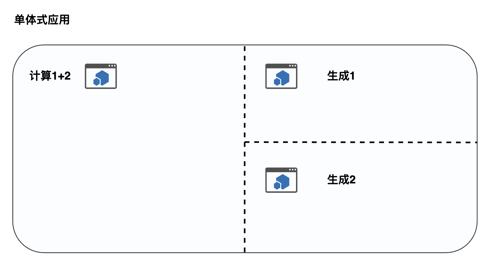
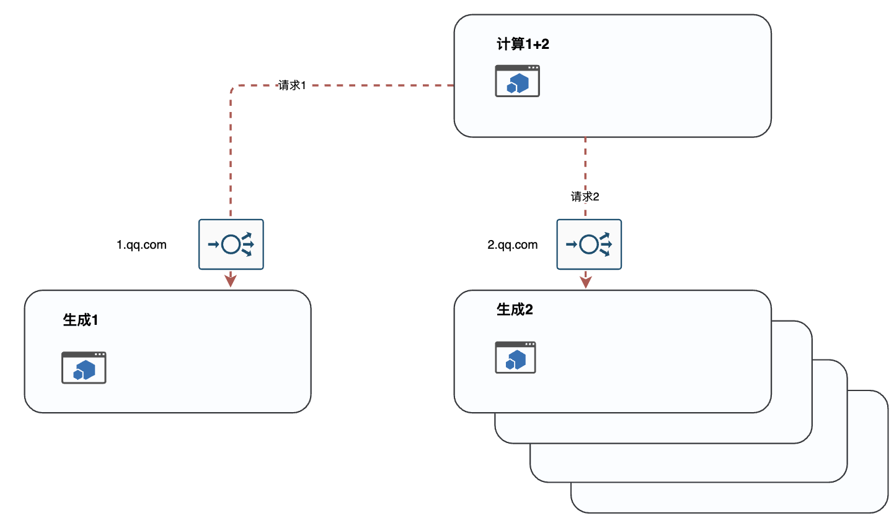
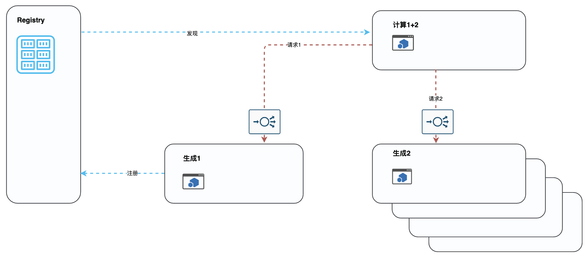

- [README](#readme)
  - [Topics](#topics)
    - [什么是服务注册和发现](#什么是服务注册和发现)
    - [为什么会出现服务注册发现](#为什么会出现服务注册发现)
  - [传统的单体式应用会带来什么问题](#传统的单体式应用会带来什么问题)
  - [微服务的架构如何解决了这些问题, 又带来了什么问题](#微服务的架构如何解决了这些问题-又带来了什么问题)
  - [服务注册与发现工具如何帮我们解决以上问题](#服务注册与发现工具如何帮我们解决以上问题)
  - [https://github.com/woshisbb43/consul_sample](#httpsgithubcomwoshisbb43consul_sample)
# README
<!-- This is a sample application for consul introduction -->
<!-- we mainly address following problems \ -->
该程序用于解释consul服务注册与发现的基础概念

## Topics
### 什么是服务注册和发现
1. 提问
2. 简要解释
  
    提供服务方将服务的信息(端口，ip 等)放入服务寄存中心，并和服务使用方约定好服务id \
    服务使用方通过服务id动态获取服务信息并使用

### 为什么会出现服务注册发现
1. 传统的单体式应用会带来什么问题
2. 微服务的架构如何解决了这些问题
3. 微服务的架构又带来了什么问题

## 传统的单体式应用会带来什么问题

1. 系统升级-解耦

    `在 8080 端口起单个服务，包含3个功能，生成数字1；生成数字2；1+2；`
2. 多地部署-复用
## 微服务的架构如何解决了这些问题, 又带来了什么问题

1. 微服务暴露的接口的ip变了怎么办，端口变了怎么办，域名变了怎么办 

    `在 8081;8082;8083起了3个服务，分别提供： 生成数字1(foo_1)；生成数字2(foo2)；1+2(calculate)的服务`\
    `更改生成数字2(foo2)的端口8082->8084 测试1+2(calculate)的服务是否正常`
    `在1+2(calculate)服务中更改端口号为8084，再看服务是否正常`
    
    服务提供方要通知服务使用方变更代码里面硬编码的接口信息/ 配置文件中的接口信息。\
    想象一下 1个服务方 通知督促 100个服务使用方更改接口信息\
    想象一下 1个服务接收方，可能同时调用20多个其他服务，要维护一个配置文件，过一段时间就要更新某个服务的接口信息

2. 如果是lb或者应用网关在服务前面，如果lb或者应用网关挂了怎么办

    有一定单点失败的风险（虽然lb单点失败的可能性极小 aws: 99.99 azure 99.99 腾讯云 99.95 阿里云 99.95 华为云 99.95），一旦失败会导致服务不可用

## 服务注册与发现工具如何帮我们解决以上问题

1. 微服务暴露的ip，端口改变了

    服务提供方和服务使用方沟通好，对于某个接口以特定名字命名该接口，服务提供方更新的任何信息服务接受方都可动态地通过编码的方式获取，无需人工干预

2. 如果是lb或者应用网关在服务前面，如果lb或者应用网关挂了怎么办

    服务注册信息中包含该服务所有实例信息，服务使用方可根据自己的需求使用这些信息

## https://github.com/woshisbb43/consul_sample